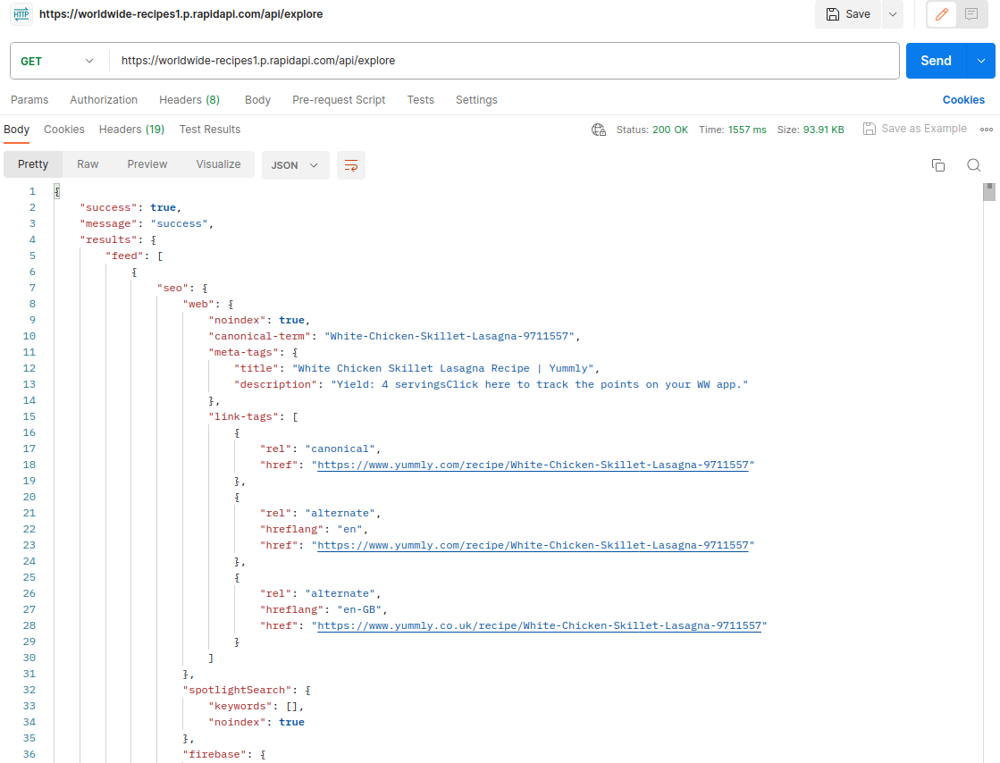
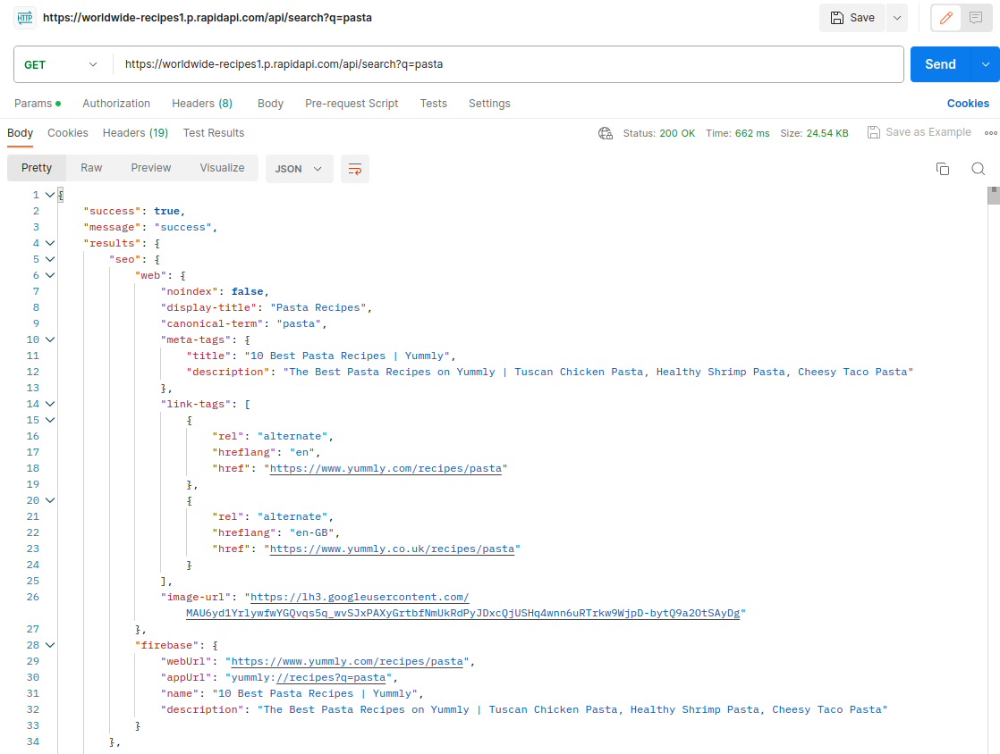
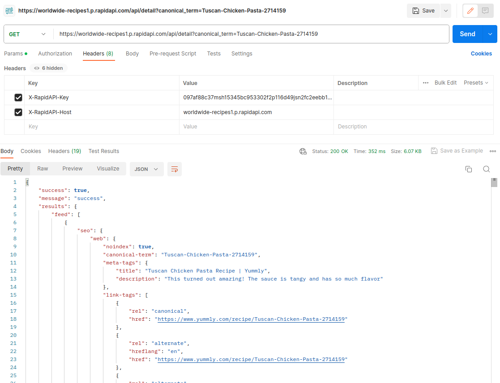

  <h1 align="center"> 
  <h1 align="center" style="font-style:italic;">
  SmartFridge</h1>
    <h5 align="center"> <i style="color:grey;"> 
   A companion for your meals</i> </h5>

🔴 **Video demostración:** [Click Aquí!](https://youtu.be/Q0AqtbT0X9Q?si=kA7dIcc781y0b7L1)

🔴 **Video Explicación Tecnica**: [Click Aqui!](https://youtu.be/WnpI1QcRkc0)

Smart Fridge es una aplicación que se encargará de recomendarte recetas de cocina en base a lo que exista en tu refrigerador.

## Estructura del Proyecto

Esta solución la dividimos en dos secciones principales:

- **Backend**, el cual está escrito en Rust, además se utiliza una base de datos escrita en postgress para guardar los datos del usuario.
- **Frontend**, el cual está escrito en Kotlin con android studio. Se conecta al backend y le muestra al usuario toda la información de forma estética.

## Servicios

Esta aplicación utiliza una API personal para guardar la información del usuario dentro del backend y un servicio externo llamado: [WorldWide Recipes](https://rapidapi.com/ptwebsolution/api/worldwide-recipes1/).

- API Interna: Es una API que expondrá el backend para guardar datos del usuario, así como para obtener los datos de las recetas.
- [WorldWide Recipes](https://rapidapi.com/ptwebsolution/api/worldwide-recipes1/): Es la API que utilizará el backend para obtener las recetas que mostrará el cliente.

#### WorldWide Recipes

A continuación ejemplos llamadas a las rutas que se utilizaran de esta API.

**GET /explore**

**Get /search**

**Get /detail**

## Librerías

Una lista completa de las librerías que utiliza el cliente se pueden ver en el archivo `build.gradle` dentro de la carpeta `Android/app`.

Una lista completa de las librerías que utiliza el backend se pueden ver en el archivo `Cargo.toml` dentro de la carpeta `backend`.

Una lista de las más destacadas son:

- **Json Serializer**, librería de Google para parsear JSON en kotlin.
- **KTOR**, librería usada en el cliente móvil para conectarse al backend.
- **Serde**, librería en el backend utilizada para convertir objetos a JSON.
- **Axum, Tokio, Tower**, librerías que facilitan la creación de una REST-API, se utilizan en el backend.
